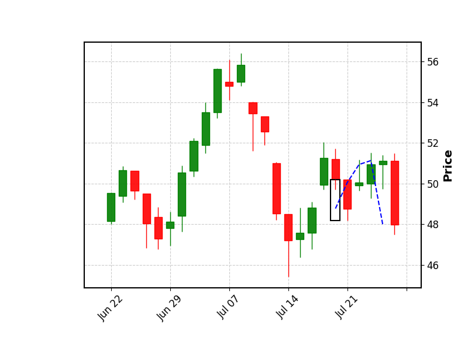

# Heimdall

## A Multimodal Commodity Price Prediction & Pattern Recognition Tool

Heimdall is a research tool for **visualizing and predicting commodity price trends** (stocks, ETFs, etc.) through a **multimodal approach**. It integrates **historical OHLCV data** with **technical chart analysis** to detect candlestick patterns and forecast trends.  

The system combines:  
- **Numerical Time-Series Models** – leveraging LSTMs and statistical methods (SMA, EMA) on OHLCV data.  
- **Visual Chart Models** – using a Vision Transformer (ViT) trained on annotated candlestick charts with support/resistance and breakout levels.  

---

## 📂 Project Structure & Key Files  

### 1. `alphavantage.v1.py`  
**Purpose**: Fetch and preprocess raw stock market data.  

**Key Features**:  
- Integrates with **Alpha Vantage API** to download historical OHLCV data.  
- Saves data to CSV for later processing.  
- Outputs a clean **pandas DataFrame** ready for downstream tasks (chart generation, LSTM training).  

---

### 2. `Pattern Identifier Annotated.py`  
**Purpose**: Detect candlestick patterns and generate annotated charts.  

**Key Features**:  
- Uses **TA-Lib** to identify candlestick patterns (with a default **window size of 20**).  
- Generates candlestick charts with **mplfinance** and **matplotlib**.  
- Highlights detected pattern candles with bounding boxes.  
- Draws a **trendline for the next 5 candles** after the detected pattern.  
- Saves charts as `.png` images, with **filenames named after the detected pattern** (e.g., `CDL3INSIDE_bearish_205.png`).  
- Exports `image_labels.csv` mapping filenames to pattern labels for use in supervised learning.  

---

## 📊 Example Output  

Example chart with **pattern annotation** and **trendline**:  

  

- The black rectangle marks the detected candlestick pattern.  
- The dashed blue line indicates the price trend for the following 5 candles.  
- File is saved with the **pattern label in the name** for dataset preparation.  

---

## 🔑 Current Focus  
- Building a **pattern-labeled chart dataset** automatically using TA-Lib + matplotlib.  
- Each chart = **one detected candlestick pattern + future trendline**.  
- These labeled charts form the **vision branch** for training the Vision Transformer.  

---

## 🚀 Next Steps  
- Train a **Vision Transformer (ViT)** on the generated chart dataset.  
- Fuse predictions from ViT with an **LSTM model** trained on historical OHLCV values.  
- Extend ensemble with SMA/EMA baselines for comparison.  
